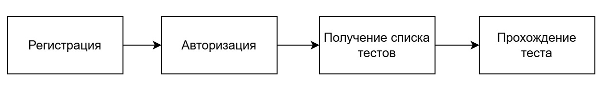

# MentalArtAI_tests

Автоматизированные smoke и негативные тесты для проверки базового сценария пользователя:

*Ссылка на сайт: https://mentalartai.ru/*
## Стек
* Python
* httpx
* Pytest

## Что проверяет скрипт:
1. Проверка доступности сервиса (Health Check).
2. Авторизация и регистрация тестового пользователя.
3. Возможность получения списка доступных тестов.
4. Интеграционный сценарий прохождения теста (загрузка файлов, связка бэкенда с хранилищем и ИИ-моделью).
5. Проверка невалидных значений (негативный тест)

## Запуск
1. Создайте и заполните файл `.env`.
2. Настройте окружение и запустите скрипт:
   ```bash
   python -m venv venv
   # Linux/macOS: source venv/bin/activate
   # Windows: venv\Scripts\activate
   pip install -r requirements.txt
   pytest tests.py