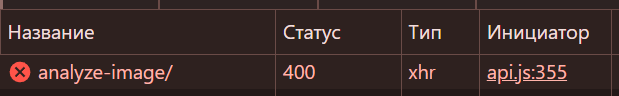
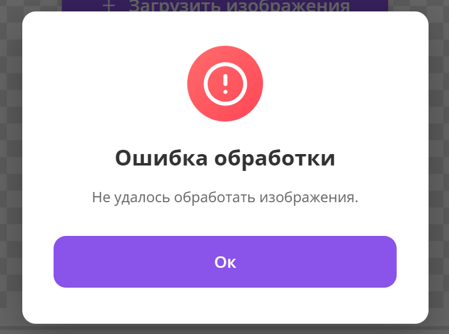

# Пример баг-репорта - MentalArtAI

### Заголовок
При загрузке файла некорректного формата он отправляется на сервер, а не блокируется на фронтенде.

### Описание
При загрузке файла некорректного формата файл отправляется на сервер, а не блокируется на фронтенде. Ошибка отображается некорректно.

### Шаги воспроизведения
1. Авторизоваться в системе.
2. Перейти к тестам.
3. Нажать на любой тест.
4. Нажать кнопку «Начать выполнение теста».
5. Нажать кнопку «Загрузить изображения».
6. Загрузить файл любого формата, кроме изображений (например, `.pdf` или `.txt`).

### Фактический результат
Появляется алерт «Ошибка обработки», а файл отправляется на сервер, хотя должен блокироваться еще на фронтенде.

### Ожидаемый результат
Файл блокируется на фронтенде, отображается предупреждение: *«Неверный формат файла. Выбранные файлы не являются изображениями.»*. Запрос на сервер не отправляется.

### Окружение
* **ОС:** Windows
* **Браузер:** Google Chrome

### Вложения

### Дополнительная информация
